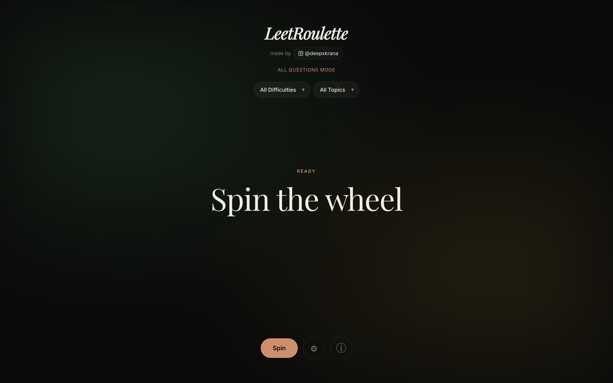

# LeetRoulette

A sleek, minimalist tool to help you pick LeetCode problems at random, built with React and Vite. Say goodbye to decision fatigue and let the roulette decide your next coding challenge!

 <!-- Note: Add a screenshot of the app here -->

## Features

- **Sleek Interface**: Ultra-minimalist, dark-mode aesthetic with satisfying animations powered by `framer-motion`.
- **All Questions Mode**: By default, it loads a comprehensive pool of 4,000+ public LeetCode questions.
- **Custom Data Mode**: Upload a JSON file of your own solved LeetCode problems to practice exactly what you need.
- **Smart Filtering**: Filter the question pool by specific **Difficulties** (Easy, Medium, Hard) or **Topics** (Arrays, Two Pointers, Dynamic Programming, etc.).
- **Prioritize Unseen**: Toggle an option in settings to heavily favor problems the roulette hasn't landed on yet during your current session.
- **Satisfying Sounds**: Features custom Web Audio API-generated percussive clicks and a chime when the wheel lands.

## How to use Custom Data

Want to practice only the problems you've actually solved or seen? We've built a companion Chrome Extension that securely fetches your solved problems directly from LeetCode and instantly syncs them to LeetRoulette with one click!

### Installing the Extension (Developer Mode)

Since the extension isn't on the Chrome Web Store yet, you can load it manually:

1. Download or clone this repository.
2. Open Chrome and navigate to `chrome://extensions`.
3. Turn on **Developer mode** (toggle in the top right corner).
4. Click **Load unpacked** in the top left.
5. Select the `extension/` folder located inside this repository.
6. The "LeetRoulette Sync" extension is now installed! Pin it to your toolbar for easy access.

### Syncing your Data

1. Make sure you are logged into your account on [leetcode.com](https://leetcode.com).
2. Click the **LeetRoulette Sync** extension icon in your toolbar.
3. Click **Sync Data**. The extension will securely fetch your solved problems (this might take a minute if you have hundreds of problems).
4. Once complete, click **Open LeetRoulette**. The web app will automatically open in Custom Mode with all your data instantly available!

## Development

This project is built using:
- **React 18**
- **Vite**
- **TypeScript**
- **Framer Motion** (for animations)

### Running Locally

1. Clone the repository:
   ```bash
   git clone https://github.com/deepxkrana/LeetRoulette.git
   ```
2. Navigate into the directory:
   ```bash
   cd LeetRoulette
   ```
3. Install dependencies:
   ```bash
   npm install
   ```
4. Start the development server:
   ```bash
   npm run dev
   ```

## Author

Made by [@deepxkrana](https://github.com/deepxkrana) | [Instagram](https://instagram.com/deepxkrana)
